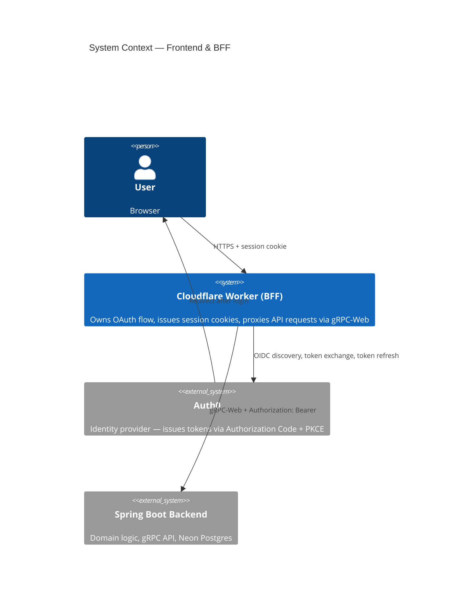
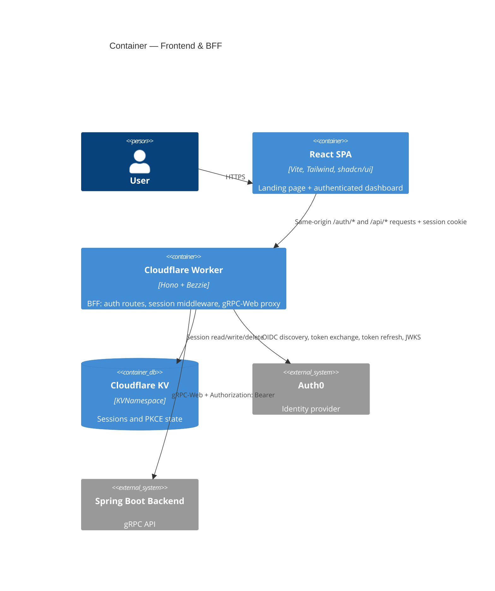

# Template Application — Frontend & BFF

React frontend and Cloudflare Workers BFF (Backend for Frontend) for the template application stack.

## What you get out of the box

- React 19 + Vite + Tailwind CSS + shadcn/ui — web UI ready to build on
- Cloudflare Workers BFF — owns the OAuth flow, session cookies, proxies to the backend
- Bezzie — BFF auth library handles the full Auth0 Authorization Code + PKCE flow
- gRPC-Web client — generated TypeScript client for talking to the Spring Boot backend
- Vitest — unit tests for React and the BFF Worker
- GitHub Actions CI — lint, test, build, deploy to Cloudflare Pages + Workers on merge to main
- Dependabot — weekly dependency updates, auto-merged for patch/minor

## Overview

This repo contains two tightly coupled layers that deploy together:

- **React app** (`apps/web`) — the browser UI, hosted on Cloudflare Pages
- **BFF** (`apps/bff`) — Cloudflare Worker that sits between the browser and the Spring Boot backend, owns the OAuth flow, and proxies API requests via gRPC-Web

These live together because the BFF exists solely to serve the frontend. They share a Cloudflare deployment.

## Repo layout

```
template-application-frontend/
├── apps/
│   ├── web/          ← React app (Vite, Tailwind, shadcn/ui)
│   └── bff/          ← Cloudflare Worker (Bezzie, gRPC-Web proxy)
└── packages/
    ├── proto/        ← Protobuf definitions + generated TypeScript gRPC-Web client
    ├── types/        ← shared TypeScript types
    └── api-client/   ← shared API client utilities
```

Managed by [Turborepo](https://turbo.build) — `npm run dev` starts both apps in parallel.

## Architecture





## Auth

Auth is handled by **[Bezzie](https://github.com/neilpmas/bezzie)** — an open source BFF OAuth 2.0 library for Cloudflare Workers. JWTs never touch the browser.

### Login flow

```
React → BFF /auth/login → Auth0 (Authorization Code + PKCE)
                                │
                           code returned
                                │
           BFF exchanges code for tokens → stored in Cloudflare KV
           BFF issues HttpOnly; SameSite=Lax session cookie (Secure in production) → React
```

### Per-request flow

```
React (session cookie) → BFF → validates session, refreshes token if needed
                              → Spring Boot (gRPC-Web + Authorization: Bearer <token>)
```

The React app never holds a token. It uses the session cookie for every request.

## Stack

| Layer | Technology | Version |
|---|---|---|
| UI | React | 19 |
| Build | Vite | 8 |
| Styling | Tailwind CSS | 4 |
| Components | shadcn/ui (Base UI primitives) | — |
| Monorepo | Turborepo | — |
| BFF | Cloudflare Workers | — |
| Auth library | [Bezzie](https://github.com/neilpmas/bezzie) | — |
| Session storage | Cloudflare KV | — |
| BFF → Backend | gRPC-Web over HTTP/2 | — |
| Hosting | Cloudflare Pages + Workers | — |

## Local development

### Prerequisites

- Node.js 20+
- npm 11 (included as `packageManager` in `package.json`)
- [Wrangler CLI](https://developers.cloudflare.com/workers/wrangler/) — `npm install -g wrangler`
- A local or deployed Spring Boot backend running on port 9090 (gRPC)

### Install

```bash
npm install
```

### Config

**BFF secrets** — copy `apps/bff/.dev.vars.example` to `apps/bff/.dev.vars` (gitignored):

```
AUTH0_CLIENT_SECRET=your-web-client-secret
```

**BFF config** — non-secret config lives in `apps/bff/wrangler.toml` under `[vars]`. For local dev, set these in `.dev.vars` too (they override the empty defaults in `wrangler.toml`):

```
AUTH0_DOMAIN=your-tenant.auth0.com
AUTH0_CLIENT_ID=your-web-client-id
AUTH0_CLIENT_SECRET=your-web-client-secret
AUTH0_AUDIENCE=https://api.yourproject.com
APP_BASE_URL=http://localhost:5173
BACKEND_URL=http://localhost:9090
```

**React app** — no env file needed. The web app makes same-origin `fetch('/api/...')` and `fetch('/auth/...')` calls, which Vite proxies to the BFF automatically (configured in `vite.config.ts`).

### Run

```bash
npm run dev          # starts both React (port 5173) and BFF Worker (port 8787) via Turborepo
```

Open `http://localhost:5173` in your browser. Vite proxies `/auth/*` and `/api/*` requests to the BFF on port 8787.

Or individually:

```bash
cd apps/web && npm run dev   # React only (port 5173)
cd apps/bff && npm run dev   # BFF Worker only (port 8787)
```

Cloudflare KV is simulated in memory by Wrangler — no Cloudflare account needed for local dev.

### Auth0 setup (local dev)

Register a separate Auth0 **Regular Web Application** for local dev (don't reuse production credentials):

- **Allowed Callback URLs:** `http://localhost:5173/auth/callback`
- **Allowed Logout URLs:** `http://localhost:5173`
- **Allowed Web Origins:** `http://localhost:5173`

Also grant your application access to the API: **Applications → APIs → your API → Application Access → User Delegated → grant the web application**.

### gRPC-Web client

The TypeScript gRPC-Web client is pre-generated in `packages/proto/src/gen/`. To regenerate from updated `.proto` files:

```bash
cd packages/proto && npm run generate
```

Requires [Buf CLI](https://buf.build/docs/installation) — `brew install bufbuild/buf/buf`.

## Testing

```bash
npm test                          # all tests via Turborepo
cd apps/bff && npm test           # BFF only
cd apps/web && npm test           # React only
```

| Layer | Approach |
|---|---|
| BFF (Workers) | Vitest + `@cloudflare/vitest-pool-workers` |
| React | Vitest + React Testing Library |
| E2E | Playwright |

## Deployment

Hosted on Cloudflare Pages (web) and Cloudflare Workers (BFF). Both deploy together via Wrangler.

### First deploy

1. Create a Cloudflare Pages project linked to this repo.
2. Set Workers secrets via Wrangler:
   ```bash
   cd apps/bff
   wrangler secret put AUTH0_CLIENT_SECRET
   wrangler secret put AUTH0_CLIENT_ID
   wrangler secret put AUTH0_DOMAIN
   wrangler secret put AUTH0_AUDIENCE
   wrangler secret put APP_BASE_URL
   wrangler secret put BACKEND_URL
   ```
3. Create the KV namespace and update the ID in `wrangler.toml`.

### Subsequent deploys

Push to `main` — GitHub Actions deploys automatically via `wrangler deploy`.

## Auth0 config reference

These values are set as [Workers secrets](https://developers.cloudflare.com/workers/configuration/secrets/) — never in `wrangler.toml` or committed to source control.

| Variable | Description |
|---|---|
| `AUTH0_DOMAIN` | e.g. `your-tenant.auth0.com` |
| `AUTH0_CLIENT_ID` | Web application client ID |
| `AUTH0_CLIENT_SECRET` | Web application client secret — BFF only, never exposed to browser |
| `AUTH0_AUDIENCE` | API identifier, e.g. `https://api.yourproject.com` — must match backend |
| `APP_BASE_URL` | e.g. `https://app.yourproject.com` |
| `BACKEND_URL` | Spring Boot backend URL, e.g. `https://api.yourproject.fly.dev` |

## Part of

See [template-application-planning](https://github.com/neilpmas/template-application-planning) for the full stack overview, architecture decisions, Auth0 setup guide, and project workflow.
