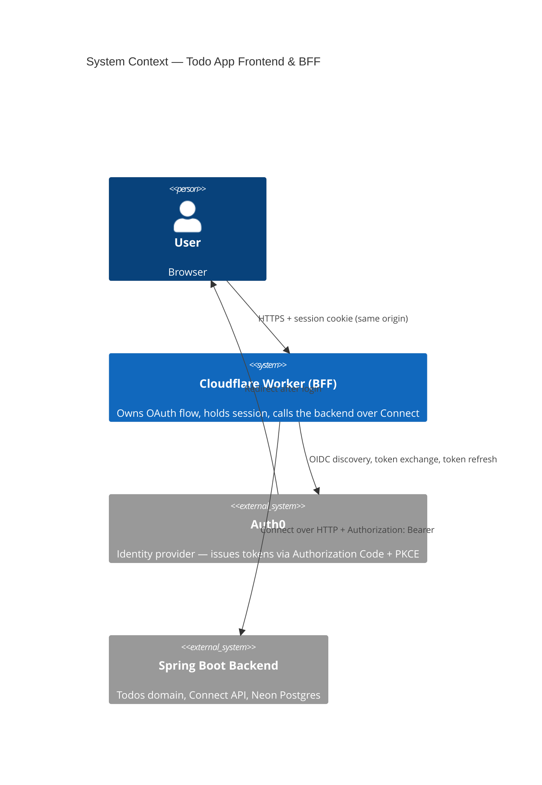
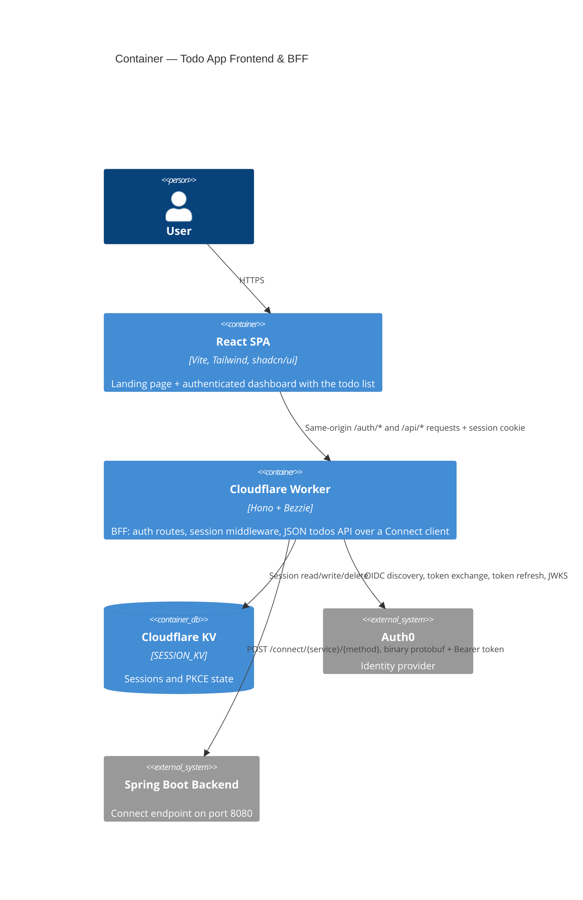

# Todo App — Frontend & BFF

React web app and Cloudflare Workers BFF (Backend for Frontend) for the Todo App.

Live at [todo.neilmason.dev](https://todo.neilmason.dev). The Spring Boot backend lives in
[todo-app-backend](https://github.com/neilpmas/todo-app-backend).

## What's in here

- React 19 + Vite + Tailwind CSS + shadcn/ui (Base UI primitives) — the todo list UI
- Cloudflare Workers BFF — owns the OAuth flow and session, proxies the todos API
- Bezzie — BFF auth library handling the full Auth0 Authorization Code + PKCE flow
- Connect protocol client — generated protobuf-es types plus `@connectrpc/connect`
- Vitest — unit tests for React and the BFF Worker
- GitHub Actions CI — lint, build, test on every push and PR
- Dependabot — weekly dependency updates, auto-merged for patch/minor

## Overview

Two tightly coupled layers that deploy together, both as Cloudflare Workers, unified under
one hostname:

- **React app** (`apps/web`) — the browser UI, served as Workers Static Assets, catch-all
  route on `todo.neilmason.dev/*`
- **BFF** (`apps/bff`) — Cloudflare Worker on `todo.neilmason.dev/api/*` and `/auth/*`. Owns
  the OAuth flow, holds the session, and calls the Spring Boot backend over the
  [Connect protocol](https://connectrpc.com/docs/protocol/)

They live together because the BFF exists solely to serve this frontend, and sharing an
origin is what keeps every browser request same-origin.

## Repo layout

```
todo-app-frontend/
├── apps/
│   ├── web/          ← React app (Vite, Tailwind, shadcn/ui, Workers Static Assets)
│   └── bff/          ← Cloudflare Worker (Hono + Bezzie, Connect client)
└── packages/
    ├── proto/        ← Protobuf definitions + generated protobuf-es TypeScript
    ├── types/        ← shared TypeScript types (placeholder, currently empty)
    └── api-client/   ← shared API client utilities (placeholder, currently empty)
```

Managed by [Turborepo](https://turbo.build) — `npm run dev` starts both apps in parallel.

## Architecture





## How the BFF talks to the backend

The BFF uses `createConnectTransport` from `@connectrpc/connect-web` — **not**
`createGrpcWebTransport`. Cloudflare Workers (workerd) does not implement `http2.connect`,
so native gRPC is impossible there, and gRPC-Web is a wire format the Spring Boot backend
does not speak. Connect over plain HTTP is what both sides can actually do.

Two details worth knowing before changing `apps/bff/src/lib/`:

- **`transport.ts`** caches one transport per base URL at module scope, so a Worker isolate
  reuses it across requests instead of rebuilding it per call. Build every new client from
  `getTransport()`; don't call `createConnectTransport` inside a request handler.
- **`workersFetch.ts`** strips `redirect: "error"` from the request init before delegating to
  `fetch`. `@connectrpc/connect-web` hardcodes it, it's valid in browsers, and workerd only
  supports `"follow"` and `"manual"`. Without this wrapper the transport fails outright.

The transport points at `${BACKEND_URL}/connect` with `useBinaryFormat: true`.

The BFF exposes a plain JSON API to the browser, not Connect — the React app never sees
protobuf. Raw protobuf-es messages are never `c.json()`'d directly, because they carry an
internal `$typeName` field; `serializeTodo` in `apps/bff/src/index.ts` builds an explicit
plain object instead. Do the same for any new message type.

| BFF route | Backend call |
|---|---|
| `GET /api/me` | — (session only) |
| `GET /api/info` | `template.v1.TemplateService/GetServerInfo` |
| `GET /api/todos` | `todos.v1.TodosService/GetTodos` |
| `POST /api/todos` | `todos.v1.TodosService/CreateTodo` |
| `PATCH /api/todos/:id` | `todos.v1.TodosService/CompleteTodo` |
| `DELETE /api/todos/:id` | `todos.v1.TodosService/DeleteTodo` |

Connect errors are mapped to HTTP status codes by `handleConnectError` — `NotFound` → 404,
`PermissionDenied` → 403, `Unauthenticated` → 401, everything else → 500.

## Auth

Auth is handled by **[Bezzie](https://github.com/neilpmas/bezzie)** — an open source BFF
OAuth 2.0 library for Cloudflare Workers. JWTs never touch the browser.

### Login flow

```
React → BFF /auth/login → Auth0 (Authorization Code + PKCE)
                                │
                           code returned
                                │
           BFF exchanges code for tokens → stored in Cloudflare KV
           BFF issues HttpOnly; SameSite=Lax session cookie (Secure in production) → React
```

### Per-request flow

```
React (session cookie) → BFF → validates session, refreshes token if needed
                              → Spring Boot (Connect over HTTP + Authorization: Bearer <token>)
```

The React app never holds a token. It uses the session cookie for every request, and the BFF
adds the `Authorization` header on the way out.

`secureCookies` is set to `!isLocal` (where `isLocal` is `APP_BASE_URL`'s hostname being
`localhost`), which drops the `Secure` flag and `__Host-` prefix for local dev only.
`defaultReturnTo` is `/dashboard`.

## Stack

| Layer | Technology | Version |
|---|---|---|
| UI | React | 19 |
| Build | Vite | 8 |
| Styling | Tailwind CSS | 4 |
| Components | shadcn/ui (Base UI primitives) | — |
| Routing | React Router | 8 |
| Monorepo | Turborepo | 2 |
| BFF framework | Hono | 4 |
| BFF runtime | Cloudflare Workers | — |
| Auth library | [Bezzie](https://github.com/neilpmas/bezzie) | 1.2 |
| Session storage | Cloudflare KV | — |
| BFF → Backend | Connect protocol (binary protobuf over HTTP) | `@connectrpc/connect-web` 2 |
| Codegen | protobuf-es (`protoc-gen-es`) via Buf | 2 |
| Hosting | Cloudflare Workers (BFF + Static Assets) | — |

## Local development

### Prerequisites

- Node.js 20+
- npm 11 (included as `packageManager` in `package.json`)
- [Wrangler CLI](https://developers.cloudflare.com/workers/wrangler/) — `npm install -g wrangler`
- A local or deployed Spring Boot backend, reachable over **HTTP on port 8080**

### Install

```bash
npm install
```

### Config

**BFF** — copy `apps/bff/.dev.vars.example` to `apps/bff/.dev.vars` (gitignored) and fill it
in. The `[vars]` block in `wrangler.toml` holds the deployed (production) values, so `.dev.vars`
needs to override all of them for local dev, not just the secret:

```
AUTH0_DOMAIN=your-tenant.us.auth0.com
AUTH0_CLIENT_ID=your-auth0-client-id
AUTH0_CLIENT_SECRET=your-auth0-client-secret
AUTH0_AUDIENCE=https://api.your-app.com
APP_BASE_URL=http://localhost:5173
BACKEND_URL=http://localhost:8080
```

`BACKEND_URL` points at the backend's **HTTP port (8080)**, where the Connect endpoint lives.
Port 9090 on the backend is a native gRPC listener bound to loopback and is not usable from
here.

**React app** — no env file needed. The web app makes same-origin `fetch('/api/...')` and
`fetch('/auth/...')` calls, which Vite proxies to the BFF (configured in `vite.config.ts`).

### Run

```bash
npm run dev          # starts both React (port 5173) and BFF Worker (port 8787) via Turborepo
```

Open `http://localhost:5173`. Vite proxies `/auth/*` and `/api/*` to the BFF on port 8787.

Or individually:

```bash
cd apps/web && npm run dev   # React only (port 5173)
cd apps/bff && npm run dev   # BFF Worker only (port 8787)
```

Cloudflare KV is simulated in memory by Wrangler — no Cloudflare account needed for local dev.

Loading from Vite (rather than making the BFF the primary origin) is deliberate: it keeps
Vite's HMR WebSocket upgrade working, which breaks if the Worker fronts everything.

### Auth0 setup (local dev)

- **Allowed Callback URLs:** `http://localhost:5173/auth/callback`
- **Allowed Logout URLs:** `http://localhost:5173`
- **Allowed Web Origins:** `http://localhost:5173`

Auth0 does exact string matching, and these must match `APP_BASE_URL`'s origin — not the
BFF's internal port.

Also grant your application access to the API: **Applications → APIs → your API →
Application Access → User Delegated → grant the web application**. Without this, Auth0
returns `Client is not authorized to access resource server`. **Allow Offline Access** must
also be enabled on the API, since Bezzie requests the `offline_access` scope for refresh
tokens.

> This project currently shares one Auth0 application between local dev and production — a
> recorded, deliberate exception for a demo app, not the pattern to copy. A real app should
> register one per environment.

### Regenerating the protobuf types

Generated protobuf-es TypeScript lives in `packages/proto/src/gen/`. The `.proto` files in
`packages/proto/proto/` must stay in sync with the backend's `src/main/proto/`. To
regenerate:

```bash
cd packages/proto && npm run generate
```

Requires the [Buf CLI](https://buf.build/docs/installation) — `brew install bufbuild/buf/buf`.
`buf.gen.yaml` runs `protoc-gen-es` only: it emits message types and service descriptors, not
a transport-specific client. The client comes from `createClient(Service, transport)` in
`@connectrpc/connect` at runtime.

## Testing

```bash
npm test                          # all tests via Turborepo
cd apps/bff && npm test           # BFF only
cd apps/web && npm test           # React only
```

| Layer | Approach |
|---|---|
| BFF (Workers) | Vitest + `@cloudflare/vitest-pool-workers` (`apps/bff/test/`) |
| React | Vitest + React Testing Library (`apps/web/src/**/*.test.tsx`) |

## Deployment

Both apps deploy as Cloudflare Workers under `todo.neilmason.dev`, each with its own
`wrangler.toml`:

- `apps/bff` — routes `todo.neilmason.dev/api/*` and `/auth/*`
- `apps/web` — route `todo.neilmason.dev/*` (catch-all), serving `dist/` via `[assets]` with
  `not_found_handling = "single-page-application"`

> Don't add a `public/_redirects` file with an SPA rule. It conflicts with Workers Static
> Assets' `single-page-application` handling and causes an infinite redirect loop — the
> wrangler config already handles SPA fallback.

### First deploy

1. Create the KV namespace and put its id in `apps/bff/wrangler.toml`.
2. Set the BFF's client secret as a Workers secret:
   ```bash
   cd apps/bff
   wrangler secret put AUTH0_CLIENT_SECRET
   ```
   The remaining non-secret values live in `[vars]` in `wrangler.toml`.
3. `npm run build`, then `wrangler deploy` in each app directory.

### Subsequent deploys

`wrangler deploy`, run manually from `apps/bff` and `apps/web`. CI lints, builds, and tests
every push and PR, but does **not** deploy.

## BFF config reference

Non-secret values are in `[vars]` in `apps/bff/wrangler.toml`. `AUTH0_CLIENT_SECRET` is a
[Workers secret](https://developers.cloudflare.com/workers/configuration/secrets/) and is
never committed.

| Variable | Description |
|---|---|
| `AUTH0_DOMAIN` | Bare hostname, no scheme — `dev-16c3oauv6q5ojze3.us.auth0.com` |
| `AUTH0_CLIENT_ID` | Regular Web Application client ID |
| `AUTH0_CLIENT_SECRET` | Client secret — **secret**, BFF only, never exposed to the browser |
| `AUTH0_AUDIENCE` | API identifier — `https://api.todo-app.com`. Must match the backend's `AUTH0_AUDIENCE` |
| `APP_BASE_URL` | Public origin, e.g. `https://todo.neilmason.dev` |
| `BACKEND_URL` | Spring Boot backend origin (HTTP, port 8080 locally), e.g. `https://todo-app-backend-neilpmas.fly.dev` |
| `SESSION_KV` | KV namespace binding for sessions and PKCE state |

## Part of

See [template-application-planning](https://github.com/neilpmas/template-application-planning)
for the stack overview and architecture decisions this app was built from, and
`task-todo-app` for this project's own planning notes and session history.
